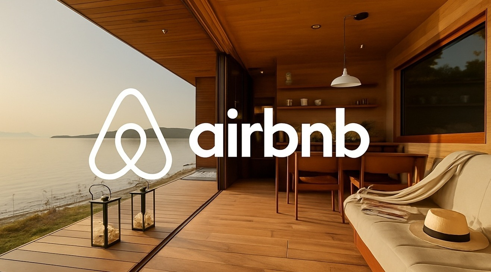

# Airbnb_Business_Regulation_Insights
Airbnb is a digital platform that links homeowners looking to rent out their properties with travelers in search of a place to stay.

## Project Link

[AirBnB Impact of Regulations](Airbnb_Regulation_Project_Analysis.ipynb)

## Overview :
This dataset features Airbnb data from over 250,000 listings across 10 major global cities. It provides comprehensive details on hosts, pricing, locations, room types, and includes more than 5 million historical guest reviews. The dataset offers valuable insights for analyzing patterns in the short-term rental market.

## Dataset :
The dataset consists of the following files:
- listings.csv
Offers in-depth information about Airbnb listings, such as host details, location, pricing, and types of accommodations.
- reviews.csv
Contains guest reviews for Airbnb listings, including reviewer details, feedback, and review dates.
- Dataset Source : [AirBnB Listing and Review Dataset](https://www.kaggle.com/datasets/mysarahmadbhat/airbnb-listings-reviews)

## Final Insights :
1. In the early phase after launch, the number of Airbnbs steadily increased along with prices, driven by initial traction and interest from early adopters.
2. As the platform gained widespread popularity and became a common utility, listings continued to grow, but prices began to decline gradually.
3. Following the announcement of regulations around 2015, confidence in the business dipped—resulting in a decline in the no of listings,while prices started increasing.
4. By 2019, once the regulations had become the new norm, the number of Airbnbs began rising again, and prices started to fall due to the increased supply.

## Recommendation :
1. Regulations on long-term rentals can negatively affect the business, potentially leading to customer and host churn due to increased uncertainty.
2. Such regulatory measures may contribute to Airbnb’s financial losses, which could be challenging to recover in the future.
3. If these changes begin to impact customer experience, it could result in a distorted or negative perception of the brand.
4. It is advisable to closely monitor similar regulatory developments in other regions and proactively prepare for them.
5. Airbnb can consider implementing similar regulatory practices in other markets as a proactive measure.
6. The platform can introduce stricter guidelines for onboarding and offboarding hosts to ensure compliance and quality.
7. Limiting the number of Airbnb listings within a locality could help maintain balance in the rental market and prevent government intervention.
